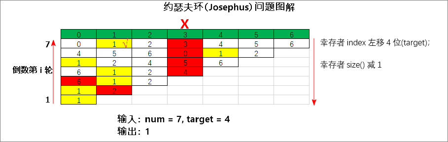

|LeetCode|要点|
|------------------------|------------------------|
|[1823. 找出游戏的获胜者][github-leetcode-1823]|逆向推导，索引右移（对当前size取模）；|
|LCR 187. 破冰游戏|逆向推导，索引右移（对当前size取模）；|



[github-leetcode-1823]: ../../1823.%20Find%20the%20Winner%20of%20the%20Circular%20Game/1823_findTheWinner.h
核心思想：逆向推导。从倒数第一轮开始。
```cpp
int findTheWinner(int n, int k) {
	int ans = 0; // 倒数第1轮，幸存者下标ans必然为0；
	for (int i = 2; i <= n; ++i) {
		ans = (ans + k) % i; // 倒数第i轮剩下i个人，下标右移k位，对人数取模。
	}
	return ans + 1; // 小伙伴的编号从1到n，所以下标值+1。
}
```
