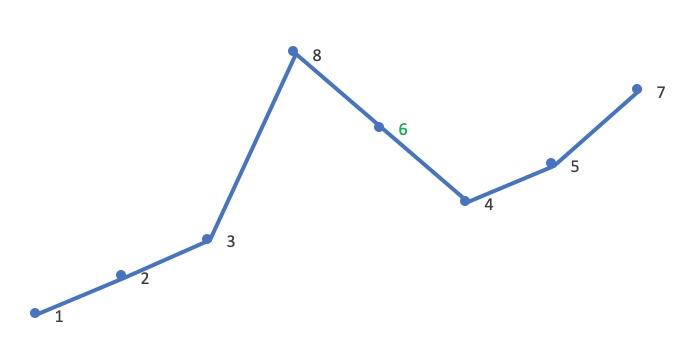

以求`12385764`的下一个排列为例：

首先从后向前查找第一个相邻升序的元素对`(i,j)`。这里`i=4`，`j=5`，对应的值为`5`，`7`：

然后在`[j,end)`从后向前查找第一个大于`A[i]`的值`A[k]`。这里`A[i]`是`5`，故`A[k]`是`6`：

将`A[i]`与`A[k]`交换。这里交换`5`、`6`：

这时`[j,end)`必然是降序，逆置`[j,end)`，使其升序。这里逆置`[7,5,4]`：

因此，`12385764`的下一个排列就是`12386457`。

最后再可视化地对比一下这两个相邻的排列（橙色是蓝色的下一个排列）：

