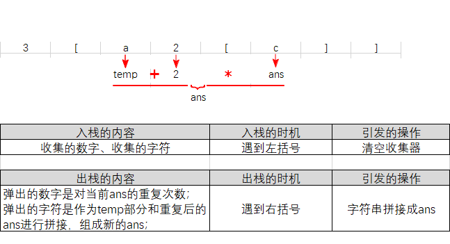

# LeetCode 394 题：“字符串解码”解题思路总结

题目要求根据给定的编码规则对字符串进行解码，编码规则是 `k[encoded_string]`，其中 `encoded_string` 重复 `k` 次，题目确保输入的格式是有效的，不会有嵌套错误。

## 解题关键点

1. **字符串解码的嵌套处理**：需要处理嵌套的结构，像 `3[a2[c]]` 这种嵌套多层的模式。遇到 `[` 时开始新的子字符串的解析，遇到 `]` 时回溯，并完成当前层的解码。
  
2. **栈的使用**：使用栈来存储暂时的部分结果和相应的重复次数。通过栈可以方便地处理括号嵌套问题，实现逐层回溯。

## 解题步骤

1. **遍历字符串**：
   - 当遇到数字时，解析出完整的数字，表示重复次数 `k`。
   - 当遇到 `[` 时，表示需要处理一个新的子字符串，将当前的结果和重复次数推入栈中，以保存之前的状态。
   - 当遇到 `]` 时，表示当前子字符串已经结束，将栈中保存的上一个状态弹出，将当前子字符串重复 `k` 次，并与之前的部分字符串拼接。
   - 遇到普通字符时，直接将其添加到当前正在构建的字符串中。

2. **栈的作用**：
   - **字符栈**：保存嵌套之前的部分字符串，等待嵌套解析完成后再进行拼接。
   - **次数栈**：保存当前的重复次数，遇到 `]` 时，从栈中弹出次数并执行相应的重复操作。

```cpp
class Solution {
public:
    string decodeString(string s)
    {
        // 2个收集器，2个存储器；
        string ans;
        int cnt = 0;
        stack<int> cntStack;
        stack<string> ansStack;

        for (char c : s) {
            if (c == '[') { // 遇到'['，把2个收集器的数据入栈，并把2个收集器清零。
                cntStack.push(cnt);
                ansStack.push(ans);
                cnt = 0;
                ans.clear();
            } else if (c == ']') { // 遇到']'，出栈，拼接。弹出的字符和当前的ans组成新的ans；
                // 此处要表达的逻辑是：ans = ansStack.top() + ans * cntStack.top()
                // 但c++不能采用乘法对字符串进行重复，只能使用循环。
                string temp = ansStack.top();
                ansStack.pop();
                int repeatCnt = cntStack.top();
                cntStack.pop();
                for (int i = 0; i < repeatCnt; ++i) {
                    temp.append(ans); // 对当前ans按照重复次数进行拼接
                }
                ans = temp; // 完成拼接，组成新的ans；
            } else if (isdigit(c)) { // collect numbers
                cnt = cnt * 10 + (c - '0');
            } else { // collect characters
                ans.push_back(c);
            }
        }
        return ans;
    }
};
```
## 具体步骤

- 使用两个栈，分别保存：
  - 当前子字符串（字符栈）。
  - 当前的重复次数（次数栈）。
  
- 遍历字符串时：
  - 如果遇到数字，将其解析成完整的数字并保存。
  - 如果遇到 `[`，将当前的部分字符串和重复次数压入栈，并重置它们。
  - 如果遇到 `]`，将栈顶的字符串和重复次数弹出，将当前子字符串重复相应次数后，与栈顶字符串拼接。
  - 普通字符则直接加入当前字符串中。
