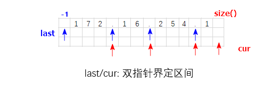

## 核心算法思想
<div align="center">
    
</div>   

### 1. 判断 IP 地址类型
- 根据 `queryIP` 字符串中是否包含 `'.'` 或 `':'` 来决定是按 **IPv4** 规则还是 **IPv6** 规则进行验证。
  - 如果包含 `'.'`，则按 **IPv4** 地址规则处理。
  - 如果包含 `':'`，则按 **IPv6** 地址规则处理。

### 2. 按照 IP 地址的格式规则逐段验证

#### IPv4 验证规则：
- **段数检查**：IPv4 地址应该被分割成 4 段。
- **段长度检查**：每段的长度必须在 1 到 3 之间。
- **字符检查**：每段必须只包含数字字符 `[0-9]`。
- **数值范围检查**：每段转换为整数后必须在 `0` 到 `255` 之间。
- **前导零检查**：如果段的长度大于 1，则不允许前导零（例如 `01` 不合法）。

#### IPv6 验证规则：
- **段数检查**：IPv6 地址应该被分割成 8 段。
- **段长度检查**：每段的长度必须在 1 到 4 之间。
- **字符检查**：每段只能包含十六进制字符 `[0-9a-fA-F]`。
- **前导零允许**：IPv6 地址允许前导零。

### 3. 逐段验证并提前返回
- **IPv4** 和 **IPv6** 的每一段都要严格按照相应的规则进行验证。
- 如果某一段不满足相应的格式要求，则立即返回 `"Neither"`，避免不必要的后续处理。

### 4. 返回最终结果
- 如果所有段都通过验证，则返回 `"IPv4"` 或 `"IPv6"`。
- 如果既不符合 **IPv4** 也不符合 **IPv6** 的规则，则返回 `"Neither"`。


```cpp
string validIPAddress(string queryIP)
{
    int last = -1, cur; // 双指针界定IP地址分段
    if (queryIP.find('.') != string::npos) {
        for (int i = 0; i < 4; ++i) {
            cur = (i == 3) ? queryIP.size() : queryIP.find('.', last + 1);
            int seglen = cur - last - 1; // 区间长度
            if (seglen < 1 || seglen > 3) { //  可以处理区间为空，或者分界符个数不够的情况。
                return "Neither";
            }
            if (seglen > 1 && queryIP[last + 1] == '0') { // 前导0
                return "Neither";
            }
            int num = 0;
            for (int j = last + 1; j < cur; ++j) {
                if (!isdigit(queryIP[j])) { // 非数字字符
                    return "Neither";
                }
                num = num * 10 + queryIP[j] - '0';
            }
            if (num > 255) {
                return "Neither";
            }
            last = cur; // 迭代准备下一轮循环
        }
        return "IPv4";
    }
    if (queryIP.find(':') != string::npos) {
        for (int i = 0; i < 8; ++i) {
            cur = (i == 7) ? queryIP.size() : queryIP.find(":", last + 1);
            int seglen = cur - last - 1;
            if (seglen < 1 || seglen > 4) { // 可以处理区间为空，或者分界符个数不够的情况。
                return "Neither";
            }
            for (int j = last + 1; j < cur; ++j) {
                if (!isxdigit(queryIP[j])) { // 非16进制字符
                    return "Neither";
                }
            }
            last = cur; // 迭代准备下一轮循环
        }
        return "IPv6";
    }
    return "Neither";
}
```
