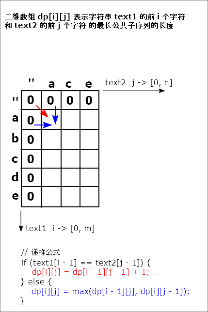

### 最长公共子序列 / 动态规划思路

1. **定义状态**：
   - 用一个二维数组 `dp[i][j]` 表示字符串`text1`的前`i`个字符 和 `text2`的前`j`个字符的最长公共子序列的长度。

2. **状态转移方程**：
   - 如果 `text1[i-1] == text2[j-1]`，则说明当前位置的字符是公共的，那么 `dp[i][j] = dp[i-1][j-1] + 1`。
   - 如果 `text1[i-1] != text2[j-1]`，则我们需要在删除 `text1[i-1]` 或 `text2[j-1]` 中选择一个，取其中的较大值，即 `dp[i][j] = max(dp[i-1][j], dp[i][j-1])`。

3. **初始化**：
   - `dp[0][*]` 和 `dp[*][0]` 均初始化为 0，因为任何一个空字符串与另一个字符串的公共子序列长度都为 0。

4. **最终结果**：
   - `dp[m][n]` 就是我们所求的两个字符串 `text1` 和 `text2` 的最长公共子序列的长度，其中 `m` 和 `n` 分别是两个字符串的长度。

5. **图解二维动态规划**

    

