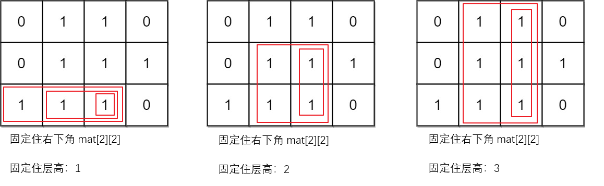

## 题目描述
给你一个 `m x n` 的二进制矩阵 `mat` ，请你返回有多少个 `子矩形` 的元素全部都是 `1` 。

## 解题思路
  - 对于每一行，通过扫描每列，记录以当前元素为右下角的最大连续 1 的列数（底座的宽度）。
  - 利用这个列数，计算以该元素为右下角的所有子矩形的数量，子矩形的高度可以从当前行向上延伸。
## 代码解析
### 1. dp 数组：
  - dp[i][j] 表示以 mat[i][j] 为结尾的当前行中连续的 1 的个数。它用于计算当前列中每一行的连续 1。
### 2. 累加子矩形：
  - 对于每个 mat[i][j]，我们向上逐行检查，寻找最窄的连续 1 的宽度（minWidth）。这样可以确定以该行作为底部的子矩形的宽度。
  - 每次找到一个有效的矩形（所有 1），我们将其计数加到结果中。
  
<div align="center">
    
</div>    

```cpp
int numSubmat(vector<vector<int>>& mat)
{
    int m = mat.size(), n = mat[0].size();
    vector<vector<int>> dp(m, vector<int>(n, 0)); // dp[i][j]表示从(i, j)开始往左，连续1的数量；也就是以(i, j)为右下角的宽度！

    // 计算每个元素左侧连续的1的数量，包括自己
    for (int i = 0; i < m; ++i) {
        for (int j = 0; j < n; ++j) {
            if (mat[i][j] == 1) {
                dp[i][j] = (j == 0) ? 1 : dp[i][j - 1] + 1; // 递推计算宽度！
            }
        }
    }

    int ans = 0;
    // 枚举(i, j)，计算以每个(i, j)为右下角的全1子矩形数量；累加到ans；
    for (int j = 0; j < n; ++j) {
        for (int i = 0; i < m; ++i) {
            int minWidth = dp[i][j];
            for (int k = i; k >= 0; --k) { // 行数k递减[i -> 0]，相当于以(i, j)为底座的层高递增；遍历所有层高；
                if (dp[k][j] == 0)
                    break;
                minWidth = min(minWidth, dp[k][j]); // 宽度取交集，以最窄的为准。
                ans += minWidth; // 固定住层高后，以(i, j)为右下角的的矩形个数就等于该层高对应的宽度！（本题核心）
            }
        }
    }

    return ans;
}
```
